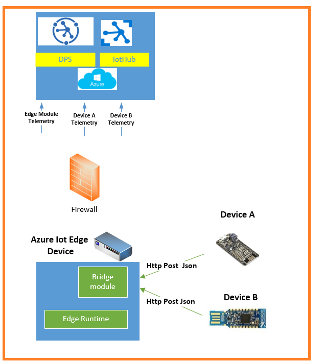

# Azure Iot Central HTTP device bridge azure edge module 

This repository contains node.js implementation of azure edge module to act as a gateway bridge between leaf devices deployed in local network.
Currently there are a lot of low level devices which are not capable to run IotHub sdks to communicate through gateway edge runtime in transparent gateway scenario. There are also devices already deployed to a field which contains logic and it simply costly to migrate them. Current module implementation exposes web server functionality which receive http post calls from iot devices in your local network and provisioning these devices as separate device identities in IotCentral and forward received telemtry to be displayed in IotCentral. 

